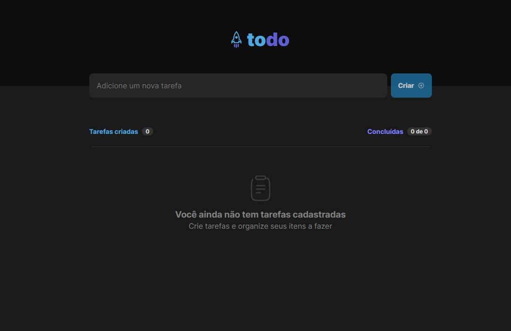
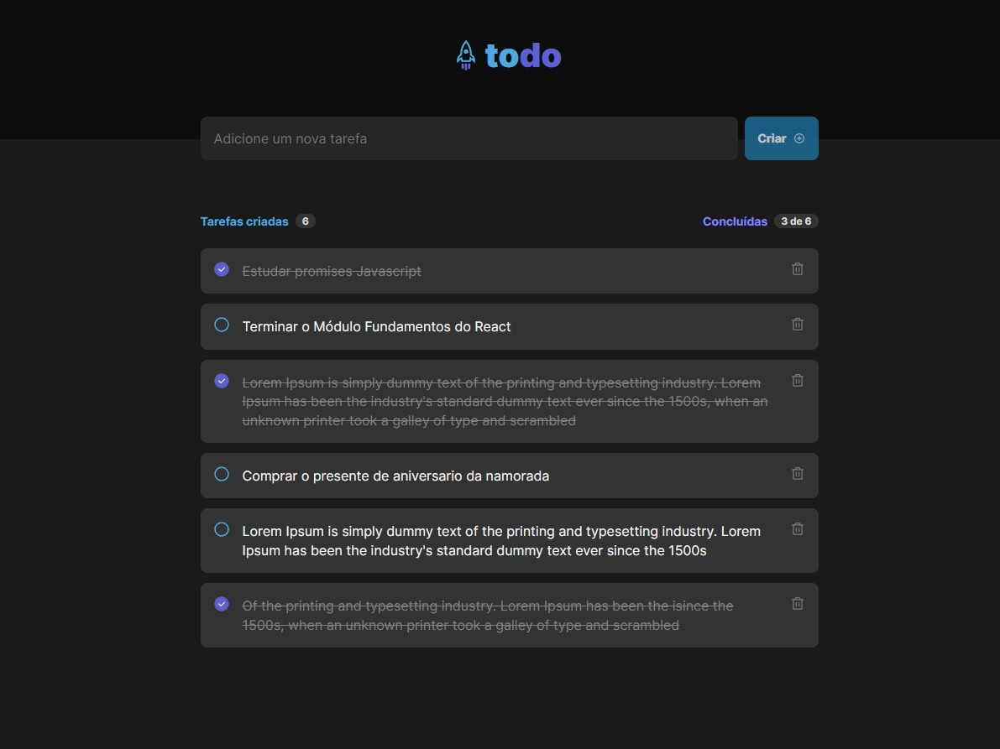

<h1 align='center'>ToDoList</h1>

<h2 align='center'>💻 Projeto</h2>

  Aplicação de uma lista de tarefas, onde o usuário pode se organizar com os seus compromissos. 

  
  

<h2 align='center'>⚙ Tecnologias </h2>

  

